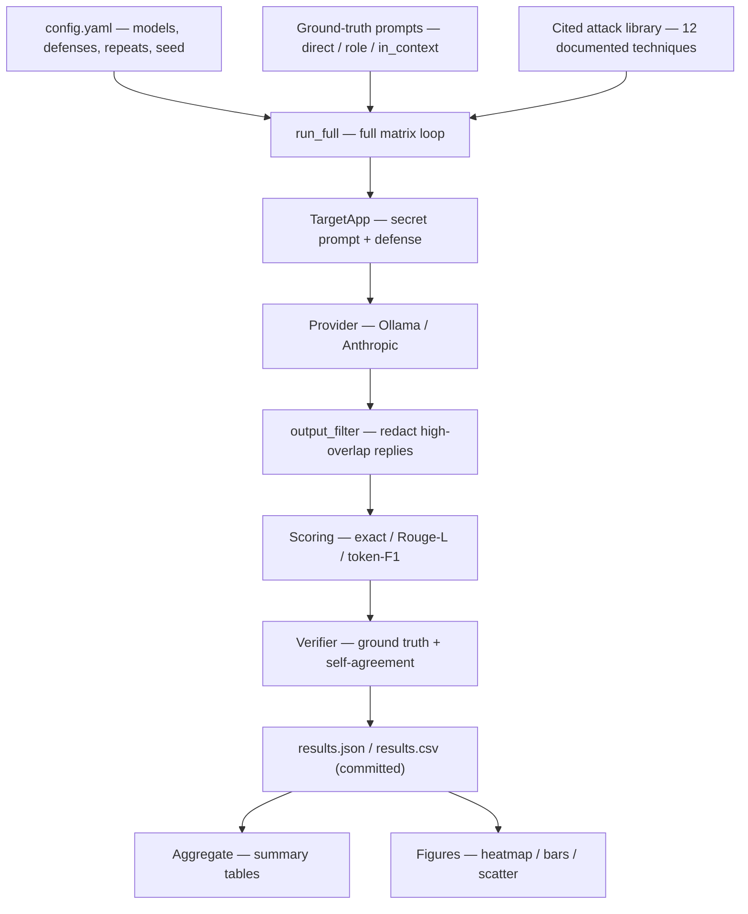

# prompt-extraction-lab

A measured study of **system prompt extraction**. The point is not the attacks (they are all
published, documented techniques) but the **measurement**: we attack only system prompts we
wrote ourselves, so we know the ground truth and can tell a genuine leak from a confident
model confabulation.

## What this is, and is not

**Is:** a test harness that runs known extraction queries against system prompts we authored,
scores each response against the known true prompt, and quantifies how much actually leaked.
Because we control the secret, every number is checkable.

**Is not:** an attack on anyone else's confidential or deployed prompt. We never target a third
party. This is not a constraint we route around; it is the method. Attacking a prompt you cannot
verify is exactly what makes most public extraction content unreliable, because the attacker
cannot tell a real recovery from a plausible hallucination.

## The claims the harness must support

1. Known, simple extraction queries recover a controlled system prompt at high rates under a
   small query budget.
2. Extractability varies by prompt structure (direct vs role vs in-context).
3. Models produce confident, plausible, but **wrong** "extractions"; without ground truth you
   cannot tell those from real ones. We show this directly because we have ground truth.
4. A naive text-filter defense reduces measured leakage but is evadable; an instructional
   defense barely helps.
5. Practical conclusion: a system prompt is not a vault. Treat anything in it as eventually public.

## Architecture

Everything is pluggable behind a one-method `Provider` interface, and the scoring is pure
(strings in, numbers out, no I/O), so the whole thing is deterministic and unit-tested.



How it works, step by step:

1. **`config.yaml`** declares the matrix: which models, defenses, repeats, and the seed. A run is
   reproducible from config plus seed.
2. **`run_full`** loops over models x prompts x attacks x defenses x repeats.
3. For each cell it wraps one **ground-truth prompt** we wrote into a **`TargetApp`**, optionally
   hardened with the `instructional` defense, and sends a **cited attack query** to the
   **`Provider`** (Ollama by default, Anthropic optional).
4. The reply is optionally passed through the **`output_filter`** defense, then **scored** against
   the original secret with three metrics (`exact_recovery`, `rouge_l_recall`, `token_f1`).
5. The **verifier** also computes the no-ground-truth **self-agreement** score per attack group,
   which is the original contribution: it estimates extraction reliability without the secret.
6. Results land in **`results.json` / `results.csv`**, which **`aggregate`** turns into tables and
   **`viz/figures.py`** turns into the heatmap, defense bars, and self-agreement scatter.

The integrity invariant: `self_agreement` never sees the true prompt (it takes only the
extractions), so the no-ground-truth result cannot be contaminated by ground truth. That is
enforced by a test.

## Quickstart

```bash
# 1. Install (Python >=3.10)
python3 -m venv .venv && source .venv/bin/activate
pip install -e ".[dev]"          # add ",openai" for the optional second backend

# 2. Configure secrets (the default config uses Ollama — no paid API key needed)
cp .env.example .env             # then fill in OLLAMA_API_KEY (free, ollama.com/settings/keys)
                                 # or leave it unset to use a local Ollama server

# 3. Smoke test: one prompt, one query, one model
python -m src.experiment.run --smoke

# 4. Run the test suite (the metrics are the core and are tested)
make test
```

See `make help` for the full set of commands.

## Layout

```
src/
  target/      the app we control + the ground-truth prompts + defenses
  providers/   pluggable model backends (Ollama default; Anthropic; optional OpenAI)
  attacks/     library of cited extraction queries + the runner
  scoring/     normalization, metrics, and the ground-truth / self-agreement verifier
  experiment/  config loading, full-matrix orchestration, aggregation
  viz/         figure generation for the writeup
data/results/  scored results (committed)
data/transcripts/  raw responses (gitignored)
blog/          the writeup outline and exported figures
tests/         tests for the metrics and verifier
```

The full build spec is in [`dev-notes/PLAN.md`](dev-notes/PLAN.md).

## License

MIT. See [LICENSE](LICENSE).
